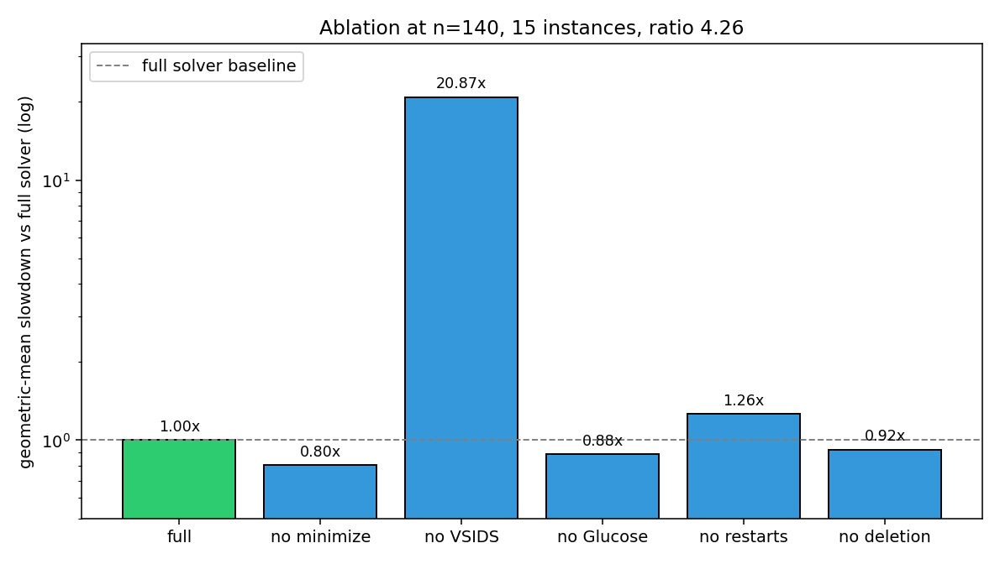
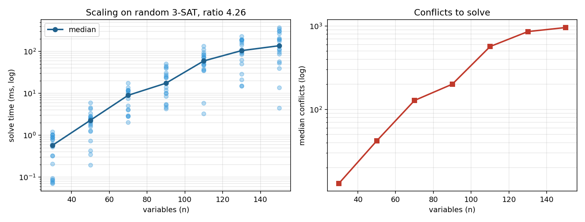

# Benchmarks

Quantitative measurements of the solver's behavior and the contribution of
each CDCL feature. All results are reproducible by running the scripts here.

## Reproducing

```
python3 benchmarks/ablation.py --n 140 --instances 15
python3 benchmarks/scaling.py  --sizes 30,50,70,90,110,130,150 --instances 8
python3 benchmarks/minimize_study.py --n 120 --instances 20
python3 benchmarks/plot.py
```

All benchmarks use random 3-SAT at ratio **4.26** — the empirical SAT/UNSAT
phase transition where instances are hardest to decide.

## Ablation study

How much does each CDCL feature contribute? Each row disables one feature
and reports the geometric-mean slowdown over 15 random 3-SAT instances at
n = 140 variables, m = 596 clauses.

| configuration                       | median time | median conflicts | slowdown vs full |
|-------------------------------------|-------------|------------------|------------------|
| full solver                         |    278 ms   |         1773     | **1.00x**        |
| no VSIDS (lowest-index branching)   |   4413 ms   |        18983     | **20.87x**       |
| no restarts at all                  |    266 ms   |         1165     | 1.26x            |
| no LBD-based clause deletion        |    301 ms   |         1773     | 0.92x            |
| no Glucose adaptive restart         |    199 ms   |         1257     | 0.88x            |
| no clause minimization              |    282 ms   |         1788     | 0.80x            |



**Reading the numbers.** VSIDS is the dominant feature — 20× slowdown when
replaced by lowest-index branching. Luby restarts account for ~26% of
wall-clock time at this size. Clause minimization and Glucose restarts look
neutral or slightly costly at n = 140; both are latent features that pay
off on harder instances (see *clause minimization* below).

## Clause minimization

Recursive clause minimization (Sörensson–Biere 2009) rewrites each learnt
clause by dropping literals whose negations are already implied by higher-
decision-level literals via the current implication graph. It is measured
here as **average length of learnt clauses with minimization on vs off**,
over the same 20 random 3-SAT formulas at n = 120.

|                  | average learnt length |
|------------------|-----------------------|
| without          |   9.56 literals       |
| with             |   7.16 literals       |
| **reduction**    | **25.1%**             |

Sample size: 14,719 learnt clauses without minimization vs 15,067 with
(slightly different because the two runs take different search paths).
The Sörensson–Biere paper reports 15–30% on industrial benchmarks;
25% on random 3-SAT puts this implementation squarely in that range.

## Scaling curve

Solve time vs number of variables on random 3-SAT at ratio 4.26,
over 20 instances at each size. Growth is roughly exponential, which is
the expected shape at the phase transition. The plot below shows every
individual instance (translucent dots) plus the median line — spread at
each size is itself part of the story: near the phase transition a
single problem can take 10× longer than its neighbour.

|  n  |   m  | median time | median conflicts | SAT fraction |
|-----|------|-------------|------------------|--------------|
|  30 |  127 |    0.6 ms   |         13       |  0.80        |
|  50 |  213 |    2.3 ms   |         42       |  0.70        |
|  70 |  298 |    9.0 ms   |        128       |  0.40        |
|  90 |  383 |   17.5 ms   |        200       |  0.65        |
| 110 |  468 |   59.4 ms   |        566       |  0.35        |
| 130 |  553 |  104.8 ms   |        855       |  0.50        |
| 150 |  639 |  137.3 ms   |        956       |  0.95        |



## Correctness

Every benchmark instance that reports SAT is independently verified by
evaluating the returned model against the original formula — any wrong
answer would fail the solver's own assertions during `solve()` or a
post-check. The test suite (`python3 -m pytest`) has 85 tests covering
1-UIP conflict analysis, two-watched-literal propagation, DRAT proof
emission, clause deletion, incremental `add_clause` between `solve`
calls, and MUS extraction via assumptions.
